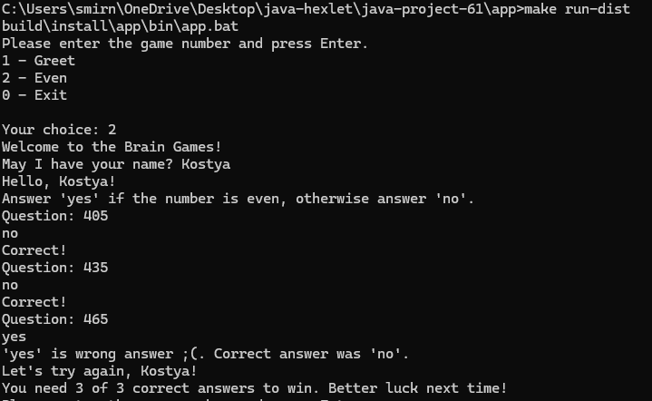
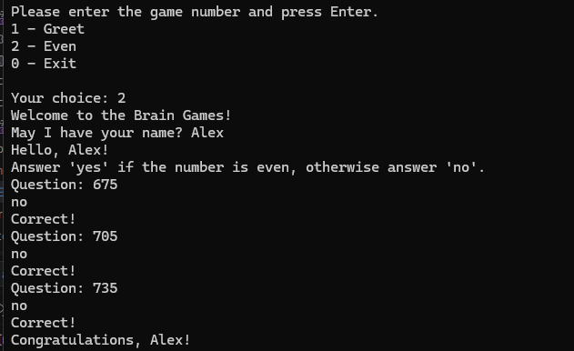
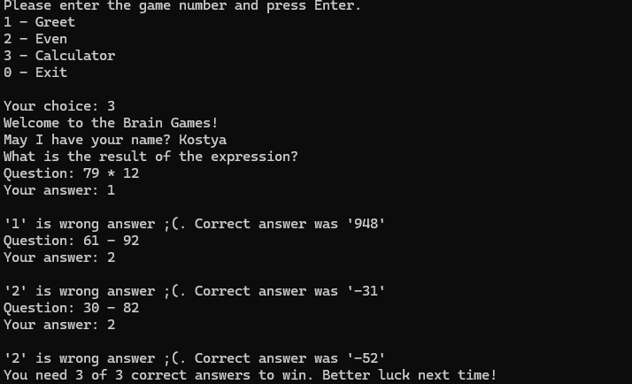
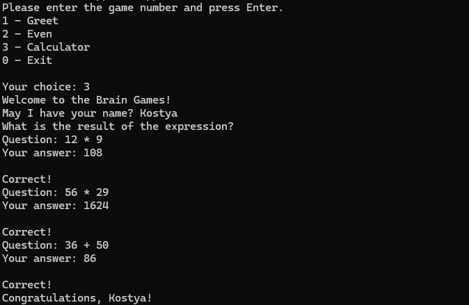

# Игры разума (Java)

[](https://github.com/h8masha/java-project-61/actions)

## Стек

- Java

## Установка

### Для пользования данным приложением необходимо иметь следующие инструменты
1. #### Java 21
2. #### Gradle
3. #### Make

<!-- Опишите установку: клонирование, зависимости, переменные окружения -->
### При наличии вышеописанных инструментов порядок запуска приложения следующий (Windows)
1. Клонировать репозиторий
2. Перейти в папку проекта java-project-61/app
3. Выполнить проверку кода линтером (форматтером)
4. Собрать проект
5. Упакуйте приложение всеми необходимыми зависимостями
6. Запустите консольное приложение с помощью утилиты Make

```bash
git clone https://github.com/h8masha/java-project-61.git
cd java-project-61/app
.\gradlew.bat spotlessApply
.\gradlew.bat build
.\gradlew.bat installDist
make run-dist
```

## Использование
#### После запуска консольного приложения пользователю будет предоставлен выбор запуска одной из нескольких игр:
1. Even - игра с определением четности числа
2. Calculator - игра на нахождение правильного ответа арифметического выражения
3. 
5.
<!-- Добавьте примеры запуска и запись asciinema — именно это смотрит работодатель -->

## Описание игр

### 1. Even: необходимо правильно определить четность числа 3 раза
### Пример запуска игры **"Even"**
#### Неудачный сценарий (проигрыш)

#### Удачный сценарий (победа)

---

### 2. Calculator: необходимо правильно посчитать значение выражения
### Пример запуска игры **"Calculator"**
#### Неудачный сценарий (проигрыш)

#### Удачный сценарий (победа)

---

<details>
<summary>Автоматические тесты Хекслета</summary>

Тесты запускаются на каждый коммит. За запуск отвечает файл `.github/workflows/hexlet-check.yml` — не удаляйте и не переименовывайте ни его, ни репозиторий.

</details>

## О Хекслете

[Хекслет](https://ru.hexlet.io/) — школа программирования: авторские программы обучения с практикой, поддержкой наставников и реальными проектами, которые остаются в резюме. Этот репозиторий — один из таких проектов.
